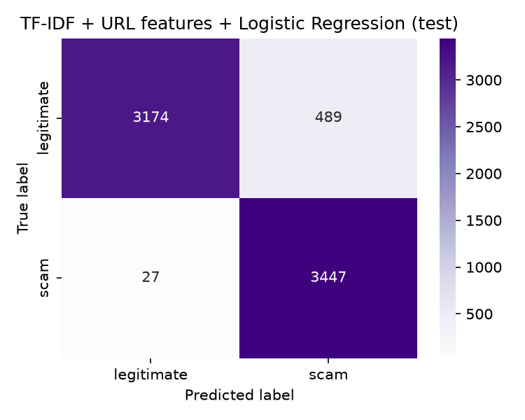
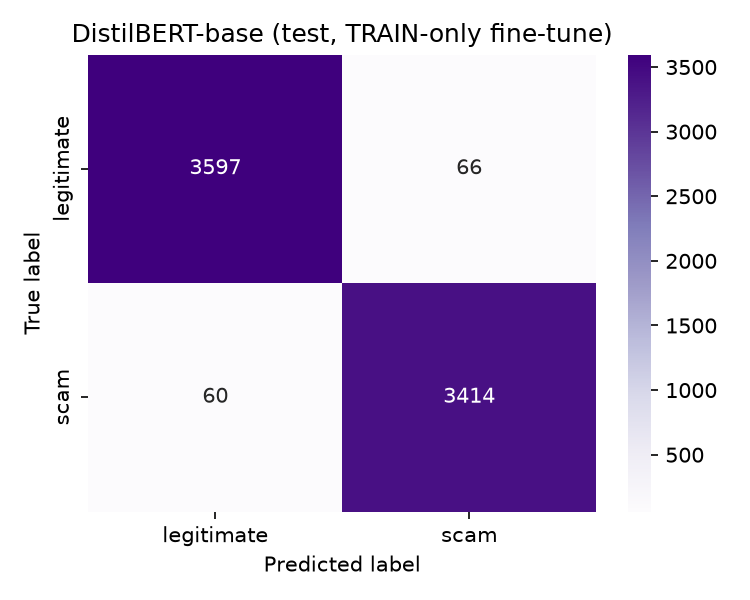
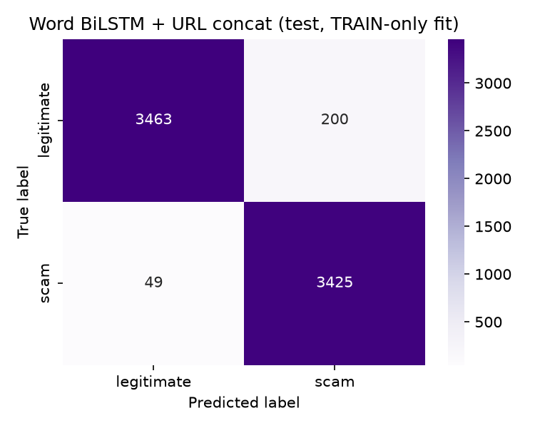

# Secure Chat with Client-Side Scam Detection

Secure Chat is a portfolio-grade real-time messaging system designed so the server stores and relays ciphertext but never receives message plaintext or private/symmetric key material. Decrypted messages are classified for phishing and scam indicators locally in the recipient's browser.

> Status: Slice 5. Registration and login are real (Argon2id + Postgres + rate limiting), JWT access/refresh tokens rotate on use with reuse detection, X25519 public keys can be uploaded/looked up over the authenticated API, and the browser generates its own identity keypair and seals the private half in IndexedDB with Argon2id. Two browser tabs can hold a real end-to-end encrypted 1:1 conversation: the server stores and relays `{ciphertext, nonce, key_epoch}` only, and clients encrypt with XChaCha20-Poly1305 plus associated data before send. DistilBERT is fine-tuned offline on the full 71,370-row LLM rewrite (fp16 on the RTX 4060); it is not loaded in the browser yet. A later DistilBERT one-at-a-time hyperparameter sweep lives under `ml/reports/distilbert_param_sweep/` and does **not** replace the Slice 5 default (`max_length` 256) until ONNX Runtime Web cost is measured. A matching TF-IDF one-at-a-time sweep lives under `ml/reports/baseline_param_sweep/` and does **not** replace the published TF-IDF default (50k terms, C=0.25, threshold 0.30) until the TypeScript TF-IDF + ONNX logistic-head path is measured. A matching word-BiLSTM one-at-a-time sweep lives under `ml/reports/lstm_param_sweep/` (quality candidate: 8 epochs, threshold 0.20) and does **not** replace the published LSTM default (4 epochs, threshold 0.30) until ONNX Runtime Web cost is measured — switch back to `ml/reports/lstm/` if that candidate is a poor browser fit. Client-side ONNX Runtime Web and the scam warning banner still arrive in later reviewed slices.

## Architecture

The browser generates its X25519 identity keypair locally (`crypto/keyExchange.ts`), seals the private half in IndexedDB with a password-derived Argon2id key (`crypto/keyVault.ts`), derives directional session/epoch keys, encrypts with XChaCha20-Poly1305, and decrypts authenticated envelopes. FastAPI authenticates users, issues/rotates JWTs, stores/serves public keys, coordinates the non-secret per-conversation epoch counter, and relays conversation-scoped ciphertext over WebSocket. PostgreSQL stores account metadata (`users`), refresh-token hashes (`refresh_tokens`), 1:1 membership plus `current_epoch` (`conversations`), and encrypted envelopes only (`messages`: ciphertext, nonce, key_epoch). The server has no code path that decrypts a message or handles a private/symmetric key.

## Threat model


### Intended protections

- Database dumps and honest-but-curious server operators cannot read message content because decryption keys remain on end-user devices.
- XChaCha20-Poly1305 authenticates ciphertext and associated conversation metadata, making tampering and cross-conversation replay detectable.
- Argon2id password hashing, short-lived (15 min) access tokens, rotating refresh tokens (single-use, 7-day lifetime), and rate limits on both `/auth/register` and `/auth/login` reduce account-compromise risk.
- Refresh-token rotation detects reuse: presenting an already-rotated token revokes every other active refresh token for that account, forcing full re-authentication instead of silently tolerating a stolen token.
- The X25519 private key is generated in the browser, never transmitted, and only ever persisted sealed (AEAD-encrypted with an Argon2id-derived, password-based key) in IndexedDB; the server only ever receives and stores the public half.
- React text rendering avoids raw HTML injection from user-controlled messages and usernames.


### Explicit limitations

- The server can observe metadata such as account identities, conversation membership, message timing, message size, and non-secret epoch numbers.
- A compromised endpoint, malicious browser extension, or attacker who knows the user's password and accesses the local key vault can read plaintext available on that endpoint.
- Static long-term X25519 keys plus epoch derivation provide key separation, not true forward secrecy. A complete Double Ratchet is intentionally out of scope.
- Public-key authenticity is initially trusted on first use; key transparency or out-of-band safety-number verification is future work.
- Multi-device key synchronization and recovery are outside the first implementation scope.
- Browser WebSocket clients cannot set an `Authorization` header, so Slice 4 sends the short-lived access token as a query parameter (`?access_token=`). Access logs or a copied URL could capture that token until it expires (15 minutes). A one-time WebSocket ticket is future hardening; do not treat the query string as a long-lived secret.


## Security design decisions

- **AEAD:** use `crypto_aead_xchacha20poly1305_ietf_`*, not `crypto_secretbox`, so the mandated XChaCha20 primitive and associated data are both supported.
- **Associated data:** authenticate a canonical encoding of `conversation_id`, `sender_id`, and `key_epoch`.
- **KDF context:** use the required eight-byte context `msgkey01`; the original seven-byte value would fail in libsodium.
- **Epoch claims:** describe the design as per-epoch key separation and compromise containment, not forward secrecy.
- **JWT library:** use maintained PyJWT instead of `python-jose`.
- **Baseline ONNX:** perform TF-IDF in TypeScript and export only the numerical classifier head to avoid unsupported ONNX Runtime Web tokenizer operators.
- **DistilBERT:** lazy-load the optional quantized model while eagerly loading the smaller baseline classifier.
- **`users.public_key` stays nullable — a documented transitional rule, not an oversight.** `POST /keys/me` requires a bearer access token, but `POST /auth/register` intentionally returns no tokens. Key upload therefore happens on the client's first successful `POST /auth/login`. Adding a database `NOT NULL` constraint would force bundling key upload into registration or inventing a placeholder key. Slice 4 conversation and message endpoints are the enforcement point: they reject either party whose `public_key is None` before a conversation can start or an envelope can be relayed.
- **JWT design (A4, PyJWT).** Access tokens are short-lived (15 min) and carry `sub`/`username`/`type`/`exp`; they are never persisted server-side. Refresh tokens are also JWTs (self-verifying signature/expiry) but the server additionally stores only a SHA-256 hash of each issued refresh token in `refresh_tokens`, matching Part B's schema refinement (`created_at`, `revoked_at`, `UNIQUE(token_hash)`) — a database read can never be turned into a usable token, the same principle as never storing recoverable passwords.
- **Refresh rotation with reuse detection.** Every `POST /auth/refresh` call revokes the presented token, win or lose. If a request presents a token that was *already* revoked (i.e., already rotated once, or logged out), that is treated as evidence of theft/replay: every other active refresh token for that account is revoked immediately, forcing the legitimate user to log in again everywhere. This goes beyond the spec's literal "rotated on use" requirement because rotation alone does not detect a stolen-and-replayed old token; verified by `backend/tests/test_auth_refresh.py`.
- **Login never distinguishes "no such user" from "wrong password."** Both return the identical `401 invalid username or password`, so the endpoint cannot be used to enumerate registered usernames — an explicit anti-pattern the spec singles out for hash/secret comparisons, and the same principle applies to any account-existence oracle.
- **`GET /keys/{username}` requires authentication even though public keys are "not secret data" (§6.2).** Gating it behind a valid access token prevents unauthenticated account-username enumeration via the key-lookup endpoint, at essentially no cost to legitimate use (a client already has to log in before it needs any peer's key).
- **Client-side key vault uses `libsodium-wrappers-sumo`, loaded on demand.** `crypto/keyExchange.ts` deliberately stays on the smaller `libsodium-wrappers` build (crypto_kx/crypto_kdf/AEAD only) so it can load eagerly on first paint. `crypto/keyVault.ts` needs `crypto_pwhash` (Argon2id) for password-derived vault sealing, which only the larger "sumo" build provides; it is dynamically `import()`ed so its extra ~190 kB (gzipped) WASM payload is fetched only when a login/registration actually seals or unseals a local identity key — the same lazy-loading principle as A6's DistilBERT opt-in.
- **`crypto_pwhash` uses `OPSLIMIT_INTERACTIVE`/`MEMLIMIT_INTERACTIVE`, not `MODERATE` or `SENSITIVE`.** These are libsodium's parameters tuned for immediate, in-browser, foreground use; `MODERATE`/`SENSITIVE` are meant for background/server contexts and would make every login noticeably slow in a tab. This is a documented security/UX trade-off: INTERACTIVE limits are weaker against offline brute-forcing of a stolen IndexedDB export than SENSITIVE limits would be, but the private key they protect is also independently useless without the account password, and IndexedDB exfiltration already requires a compromised endpoint (see the threat model above).
- **In-memory-only tokens and session state.** `AuthContext` holds the access token, refresh token, and unsealed private key only in React state — never in `localStorage`/`sessionStorage`/cookies. Reloading the page always requires logging in again. httpOnly-cookie-based refresh-token persistence is noted as future hardening.
- **WebSocket ciphertext relay (Slice 4).** `POST /conversations` starts or fetches the unique 1:1 row for a pair (`UNIQUE (user_a_id, user_b_id)` plus `CHECK (user_a_id < user_b_id)`). `GET /conversations/{id}/epoch` and the spec alias `GET /keys/conversations/{id}/epoch` return the non-secret `current_epoch` integer. `WS /ws/conversations/{id}` accepts `{ciphertext, nonce, key_epoch}`, persists BYTEA columns only, and fans the envelope to the peer. Optional `conversation_id` / `sender_id` on the frame are compared to the authenticated path/user and rejected on mismatch; cryptographic verify of associated data (`conversation_id`, `sender_id`, `key_epoch`) stays client-side (A1). Every messages-table query is scoped by `conversation_id`.
- **Epoch is key separation, not forward secrecy.** Slice 4 reads `current_epoch` (default 0) and passes it into `crypto_kdf_derive_from_key` with context `msgkey01`. Scheduled rotation is not implemented yet. Compromising the static master session key still derives every epoch; this is compromise containment, not a Double Ratchet.
- **Multi-device key recovery is explicitly unsupported, not silently broken.** If an account already has a public key on the server but the current browser has no matching sealed vault entry (a new device, a cleared profile, or a different browser), login intentionally fails with a clear `IdentitySetupError` rather than generating a second, unlinked identity that could never decrypt messages sent to the account's real public key. This matches the threat model's existing "multi-device key synchronization and recovery are outside the first implementation scope" limitation.


## Repository layout

- `backend/` — FastAPI application, tests, Docker image, and Alembic migrations.
- `frontend/` — React, Vite, TypeScript, crypto proof, component tests, and later browser inference.
- `ml/` — offline data preparation, EDA, model training, evaluation, and export.
- `docs/` — literature review and later architecture/security documentation.
- `Legacy files/` — insecure prototype retained locally for visual reference and intentionally excluded from Git.


## Local setup


### Prerequisites

- WSL2 Ubuntu
- Docker Desktop with WSL integration enabled
- Python 3.11.9 managed by pyenv
- `uv`
- Node.js 22 managed by nvm


### Environment

```bash
cp .env.example .env
```

Replace placeholder passwords and signing keys in `.env`. Never commit that file.

### Backend without Docker

```bash
cd backend
uv sync
uv run pytest
uv run uvicorn app.main:app --reload
```

The health endpoint is `http://localhost:8000/health`. Point `DATABASE_URL` at a reachable Postgres instance (e.g. `postgresql+asyncpg://secure_chat:<password>@localhost:5432/secure_chat` if you expose the Compose Postgres port locally) before running the app outside Docker; the automated tests do not need this because they run against an isolated in-memory SQLite database instead.

### Database migrations

```bash
cd backend
uv run alembic upgrade head   # apply migrations against DATABASE_URL
uv run alembic downgrade base # roll back everything (local development only)
```

Inside Docker Compose, run the same commands from the `api` container: `docker compose run --rm api uv run --no-sync alembic upgrade head`. The API container does not run migrations automatically on startup in this slice; run them once after `docker compose up` against a fresh database.

### Full local stack

```bash
docker compose up --build # --build only when image needs rebuilding or when you changed something that goes into docker image, otherwise do only docker compose up
docker compose run --rm api uv run --no-sync alembic upgrade head # first time, or after a new migration
```

Docker Compose starts FastAPI and PostgreSQL. The database has no host port because only the API should access it. Try the full auth + key flow once migrated:

```bash
# Register (no tokens issued; matches the tested Slice 2 registration contract).
curl -X POST http://localhost:8000/auth/register \
  -H 'Content-Type: application/json' \
  -d '{"username":"demo_user","email":"demo@example.com","password":"correct horse battery staple"}'

# Log in to get an access/refresh token pair; has_public_key is false on a fresh account.
curl -X POST http://localhost:8000/auth/login \
  -H 'Content-Type: application/json' \
  -d '{"username":"demo_user","password":"correct horse battery staple"}'

# Upload a (here: placeholder) base64 X25519 public key with the access token from above.
curl -X POST http://localhost:8000/keys/me \
  -H 'Content-Type: application/json' -H 'Authorization: Bearer <access_token>' \
  -d '{"public_key":"AAAAAAAAAAAAAAAAAAAAAAAAAAAAAAAAAAAAAAAAAAA="}'

# Look up any account's public key (authenticated; the key itself is not secret).
curl http://localhost:8000/keys/demo_user -H 'Authorization: Bearer <access_token>'

# Start or fetch a 1:1 conversation with a peer who also has a public key.
curl -X POST http://localhost:8000/conversations \
  -H 'Content-Type: application/json' -H 'Authorization: Bearer <access_token>' \
  -d '{"peer_username":"other_user"}'

# Read the non-secret epoch counter (spec §6.4 path; GET /conversations/{id}/epoch is equivalent).
curl http://localhost:8000/keys/conversations/<conversation_id>/epoch \
  -H 'Authorization: Bearer <access_token>'

# Rotate the refresh token; the presented token is revoked whether or not this succeeds.
curl -X POST http://localhost:8000/auth/refresh \
  -H 'Content-Type: application/json' -d '{"refresh_token":"<refresh_token>"}'
```

### Frontend

```bash
cd frontend
npm install # first time only
cp .env.example .env # only needed if the API is not on http://localhost:8000
npm run test
npm run dev
```

Open `http://localhost:5173`. Register an account, then log in: the first successful login generates an X25519 keypair in the browser, seals the private half in IndexedDB (Argon2id-derived key), uploads the public half via `POST /keys/me`, and lands on `ChatScreen`. Logging out and back in on the same browser unseals the same identity from IndexedDB instead of generating a new one.

### Two-tab encrypted conversation (Slice 4 proof)

Both API and frontend must be running, and migrations must include `conversations` and `messages` (`alembic upgrade head` as shown above).

1. Open `http://localhost:5173` in **two browser tabs**.
2. Tab A: register `alice` (or any distinct handle), then log in. Wait until the chat shell appears — that means key upload finished.
3. Tab B: register `bob`, then log in the same way.
4. In Alice's tab, enter `bob` as the peer username and click **Start encrypted chat**. In Bob's tab, enter `alice` and start the chat. Either order is fine; the server stores one canonical row with `user_a_id < user_b_id`.
5. Type a message in one tab and send it. The other tab should show the recovered plaintext. The Network panel's WebSocket frames must contain `ciphertext`, `nonce`, and `key_epoch` — never the message text.
6. If you tamper with a frame (or the associated conversation/sender metadata), the recipient shows **message failed verification** instead of garbled text.

Tokens stay in memory only: refreshing a tab requires logging in again. Multi-device key recovery is still unsupported (`IdentitySetupError`). Do not expect contacts, history pagination, typing/presence, dark mode, or a scam banner in this slice.

To inspect ciphertext-only storage after a send (API container + `psql` are optional; the automated tests already assert this):

```bash
# After sending a message in the two-tab UI, the messages table holds BYTEA only.
docker compose exec postgres psql -U secure_chat -d secure_chat -c \
  "SELECT id, conversation_id, sender_id, octet_length(ciphertext), octet_length(nonce), key_epoch FROM messages;"
```

There is no `plaintext` / `body` / `private_key` column. `GET /keys/conversations/{id}/epoch` (or `GET /conversations/{id}/epoch`) returns only `{conversation_id, current_epoch}`.

### ML workspace

```bash
cd ml
uv sync   # first DistilBERT install: CUDA torch is large; if extract times out, UV_HTTP_TIMEOUT=600 uv sync
uv run python scripts/download_sms_spam.py
uv run python scripts/download_enron_spam.py
uv run python scripts/download_spamassassin.py
uv run python scripts/download_nazario.py
uv run python scripts/download_kaggle_phishing.py  # requires ml/data/raw/Phishing_Email.csv
uv run jupyter lab
```

Raw downloaded datasets, rewritten `data/processed_chat/` and `data/processed_chat_llm/` CSVs, and generated model weights remain untracked. Open `notebooks/01_eda.ipynb` for SMS-only EDA or `notebooks/02_eda_all_corpora.ipynb` for the multi-corpus report.

### Chat-register rewrite, training, and locked chat eval

```bash
cd ml
uv run python scripts/rewrite_chat_register.py              # data/processed → data/processed_chat (rule_based_v1)
uv run python scripts/rewrite_chat_register_llm.py --no-resume   # data/processed → data/processed_chat_llm (llm_intent_v1, local Ollama)
uv run python scripts/rewrite_chat_register_llm.py --resume      # after a crash; skips finished checkpoint rows
# optional: --limit 20  |  --stratified-sample 10000  |  --model llama3.2:latest
uv run python scripts/train_baseline.py --processed-dir data/processed_chat_llm
# comparison flags: --processed-dir data/processed_chat  (rule_based_v1)
#                   --processed-dir data/processed       (original email/SMS)
uv run python scripts/build_chat_style_eval_set.py          # writes data/chat_eval/chat_style_eval_v1.csv (200 rows)
uv run python scripts/evaluate_chat_style_eval.py           # frozen C/threshold; never fits the 200-row file
uv run python scripts/train_distilbert.py                   # DistilBERT Slice 5 default (max_length 256); writes reports/distilbert/
uv run python scripts/evaluate_chat_style_eval_distilbert.py  # frozen DistilBERT threshold; never fits the 200-row file
uv run python scripts/train_lstm.py                         # word BiLSTM + URL concat; writes reports/lstm/ (does not overwrite TF-IDF or DistilBERT)
uv run python scripts/evaluate_chat_style_eval_lstm.py      # frozen LSTM threshold; never fits the 200-row file
uv run python scripts/sweep_distilbert_params.py            # optional OFAT retrain; writes reports/distilbert_param_sweep/ (does not overwrite Slice 5)
uv run python scripts/sweep_baseline_params.py              # optional OFAT retrain; writes reports/baseline_param_sweep/ (does not overwrite published TF-IDF)
uv run python scripts/sweep_lstm_params.py                  # optional OFAT retrain; writes reports/lstm_param_sweep/ (does not overwrite published LSTM)
uv run pytest
uv run ruff check scripts src tests
```

`rewrite_chat_register.py` is the deterministic `rule_based_v1` path: strip remaining headers/disclaimers/unsubscribes, informalize with contractions, keep original URLs, copy labels unchanged, cap length at 400 characters, skip empty rows, and deduplicate rewritten text the same way `load_processed_corpora` does. It is kept for comparison.

`rewrite_chat_register_llm.py` is the intent-preserving path (`rewrite_method = llm_intent_v1` when the model writes a real DM, `rule_based_v1_fallback` when it refuses twice). A local Ollama model (default **llama3.2:latest**, Llama 3.2 3B instruct, already pulled on this machine) reads each source message and writes a new 1–3 sentence WhatsApp/iMessage/DM with the same intent, facts, and binary label. Target length is about 40–600 characters of chat prose (`num_predict=400`; the LLM-only cap is 600). URLs may make the stored DM longer and are never sliced. This is not header-stripping plus truncation. Python post-conditions re-attach any original URL the model omitted (verbatim; no shorten/resolve/replace). Legitimate rows cannot gain phishing verbs that were absent from the source. Llama safety refusals are retried once with a research/register-only prompt, then that row falls back to `rule_based_v1` so labeled scams are not dropped. Refusal strings are never stored as training text. The locked file `data/chat_eval/chat_style_eval_v1.csv` is never read, rewritten, or merged. Corpus text is sent only to `http://127.0.0.1:11434` (WSL2 Ollama); cloud LLM APIs are refused.

Checkpointing uses `data/processed_chat_llm/_rewrite_checkpoint.sqlite` so a crash can `--resume` without redoing finished rows. Runtime on this WSL2 box (RTX 4060 8GB, llama3.2:latest): ~0.4–0.8s/row after GPU warmup. Full processed corpora (~71k rows) ≈ 8–12 hours per uninterrupted pass; this full run was resumed twice (10k sample → stop near 16k → finish). `--limit N` is a smoke run. `--stratified-sample 10000` is a label+source-stratified subset. Reported metrics below used the **full** processed set with the refusal-fallback path: 71,813 in, `dropped_empty=0`, `llm_failed=1`, then exact-text dedup dropped 442 rows (**71,370** left: 36,629 legitimate / 34,741 scam; 70,860 `llm_intent_v1`, 510 `rule_based_v1_fallback`). Checkpoint before dedup: 71,170 `llm_ok` and 642 `llm_refused_then_fallback`. See `ml/reports/rewrite_chat_register_llm_log.json`. Refusals no longer cull labeled scams.

`train_baseline.py` defaults to `data/processed_chat_llm`. Pass `--processed-dir data/processed_chat` for rule_based_v1 or `--processed-dir data/processed` for original email/SMS. It takes a stratified 70% train / 20% validation / 10% test split (`random_state=42`), fits TF-IDF + local URL features + `LogisticRegression` on TRAIN only, searches `C ∈ {0.25, 1.0, 4.0}` and `predict_proba[:, scam]` thresholds `0.30, 0.35, …, 0.70` on VALIDATION only, **maximizes scam recall subject to legitimate recall ≥ 0.85** (at most ~15% of real ham warned), freezes those choices, and scores TEST once. Reported numbers in `reports/baseline_metrics.json` are TEST; `reports/val_metrics.json` is the audit of the operating point. Use `--no-tune-threshold` to keep `C=1.0` and threshold `0.5`. `live_url_reputation` remains false. A later one-at-a-time sweep (widened C, VAL grid including 0.20/0.25, and one-knob TF-IDF/logistic variants) is documented under **TF-IDF one-at-a-time parameter sweep** below and writes `ml/reports/baseline_param_sweep/` without replacing this default.

`build_chat_style_eval_set.py` writes 200 hand-authored DM-style messages (100 legitimate, 100 scam covering romance, crypto, prize, "hi mom/it's me," fake-support, KYC, seed-phrase, and phishing-link patterns), including some ordinary https links so "has a URL" is not treated as automatic scam. None of it is scraped. Per `data/label-schema.yaml` `evaluation_policy.chat_style_eval_training_allowed: false`, that file is never fitted, never used to tune the threshold, and never rewritten into training. `evaluate_chat_style_eval.py` fits on TRAIN+VAL of `processed_chat_llm` (or whichever directory `baseline_metrics.json` recorded) and only calls `.predict` / `predict_proba` on the 200 rows, applying the frozen threshold from `reports/baseline_metrics.json`.

`train_distilbert.py` uses the **same** 71,370-row `llm_intent_v1` corpus, **same** 70/20/10 split (`random_state=42`), and **same** VAL rule. It fine-tunes `distilbert-base-uncased` on TRAIN only (HuggingFace + PyTorch, fp16 on this RTX 4060 8 GB). Documented hyperparameters — not searched on TEST or chat_eval — are max_length 256, batch 16, lr `2e-5`, 3 epochs, warmup 0.1, AdamW weight decay 0.01, balanced class weights. Only the decision threshold is searched on VAL (`0.30 … 0.70` step 0.05). TEST is scored once; the locked 200-row file is predict-only. Reports go to `ml/reports/distilbert/` so they never overwrite `ml/reports/baseline_metrics.json`. Weights land in `ml/models/distilbert/` (gitignored). This slice does **not** export ONNX and does **not** load the model in the browser. A later one-at-a-time sweep (expanded VAL grid including 0.20/0.25) is documented under **DistilBERT one-at-a-time parameter sweep** below and writes `ml/reports/distilbert_param_sweep/` without replacing this default.

`train_lstm.py` is a third offline track, not a Slice 5/6 replacement: same corpus, same split/seed, same VAL rule, TRAIN-only fit, TEST once, chat-eval predict-only (DistilBERT-style; not refit on TRAIN+VAL). It learns a word vocabulary from TRAIN (whitespace + punctuation split; UNK for OOV; pad/truncate at 128 tokens), a from-scratch embedding, a 1-layer BiLSTM pooled as last-forward + last-backward hidden, then concatenates the TRAIN-fitted `StandardScaler` URL feature vector (`url_features.py`; zeros when there is no link) before a 2-logit head. No C grid. Reports go to `ml/reports/lstm/` so they never overwrite TF-IDF or DistilBERT JSON. Weights land in `ml/models/lstm/` (gitignored). No ONNX, no browser wiring, no character-level LSTM (see **Word BiLSTM + URL concat** below). A later one-at-a-time sweep (expanded VAL grid including 0.20/0.25, then two post-OFAT combos) is documented under **Word BiLSTM one-at-a-time parameter sweep** below; the 8-epoch / threshold-0.20 quality candidate writes `ml/reports/lstm_param_sweep/` and does **not** replace the published 4-epoch / 0.30 default until ONNX Runtime Web cost is measured.

`uv run pytest` exercises the same pipeline against tiny synthetic data (fake LLM callback, no Ollama, no downloads, a 1-layer random DistilBERT from a local vocab file, a tiny word BiLSTM whose vocab is built from those strings) so CI never needs the multi-gigabyte raw corpora, a Hub download, or a full rewrite.

## Testing

- Backend: `cd backend && uv run pytest`
- Backend lint: `cd backend && uv run ruff check .`
- Backend types: `cd backend && uv run mypy app tests`
- Frontend tests: `cd frontend && npm run test`
- Frontend build: `cd frontend && npm run build`
- Frontend lint: `cd frontend && npm run lint`
- ML unit tests (synthetic data, no download required): `cd ml && uv run pytest`
- ML lint: `cd ml && uv run ruff check scripts src tests`
- Full service health: `docker compose up --build`, migrate, then exercise `/health`, `/auth/register`, `/auth/login`, `/keys/me`, `/keys/{username}`, `/auth/refresh`, `POST /conversations`, `GET /conversations/{id}/epoch` (or `GET /keys/conversations/{id}/epoch`), and a two-tab WebSocket conversation as shown above

Slice 1 proved the API health contract, a complete libsodium key-exchange/KDF/AEAD round trip, rejection of tampered ciphertext, and a production frontend build. Slice 2 added: a migrated `users` table; Argon2id-hashed, rate-limited, uniqueness-enforced registration exercised end-to-end through Docker Compose against real Postgres; the crypto spike productionized into `keyExchange.ts`; `AuthScreen` wired to real registration; and a trained, evaluated TF-IDF baseline.

Slice 3 added:

- **Backend:** `POST /auth/login` (Argon2id verify, rate-limited); PyJWT access tokens (15 min) and single-use, rotate-on-refresh refresh tokens with theft/replay detection (`POST /auth/refresh`); `POST /auth/logout`; a migrated `refresh_tokens` table (hash-only, `created_at`/`revoked_at`/`UNIQUE(token_hash)`); authenticated `POST /keys/me` and `GET /keys/{username}`; 19 new backend tests covering login, rotation, reuse detection, key upload/lookup validation, and rate limits.
- **Frontend:** `AuthScreen` wired to real login; a new `crypto/keyVault.ts` (IndexedDB, Argon2id-sealed private key); `crypto/identitySetup.ts` reconciling server/local key state on every login; an in-memory-only `AuthContext` (no tokens in `localStorage`); a minimal protected `ChatScreen` shown once a session exists.
- **ML:** the hand-curated, evaluation-only chat-style set (`ml/data/chat_eval/chat_style_eval_v1.csv`; 80 rows in Slice 3, now 200) and its out-of-domain evaluation report, discussed below.

Slice 4 adds:

- **Backend:** migrated `conversations` (`UNIQUE (user_a_id, user_b_id)`, `CHECK (user_a_id < user_b_id)`, `current_epoch` default 0) and `messages` (ciphertext/nonce BYTEA, `key_epoch`, index on `(conversation_id, created_at DESC)`); `POST /conversations` start-or-fetch; `GET /conversations/{id}` membership-gated fetch; `GET /conversations/{id}/epoch` plus spec alias `GET /keys/conversations/{id}/epoch`; authenticated `WS /ws/conversations/{id}` ciphertext relay that never decrypts; rejection of missing public keys, non-members, spoofed `sender_id`, cross-conversation `conversation_id`, and future `key_epoch`; 48 backend tests including a grep/AST sweep that the server never names decrypt/private-key/plaintext identifiers.
- **Frontend:** `ChatScreen` beyond the placeholder — peer username, `GET /keys/{username}`, `deriveSessionKeys` / lexicographic `crypto_kx` roles, epoch fetch, WebSocket send/receive, XChaCha20-Poly1305 + associated data, and a **message failed verification** state that never renders corrupted plaintext.
- **ML:** Slice 3 numbers are superseded by the current offline `ml/` protocol below (intent-preserving LLM chat-register rewrite, 70/20/10 split, validation-only threshold tuning, local URL features, 200-row locked chat eval). DistilBERT training is Slice 5. ONNX Runtime Web and the chat UI warning banner are still later slices.

Slice 5 adds:

- **Backend / frontend:** none. E2EE, WebSocket relay, `ChatScreen`, and auth are unchanged.
- **ML:** DistilBERT-base fine-tuned offline on the full 71,370-row `llm_intent_v1` rewrite with the same split/seed and VAL rule as the TF-IDF baseline. Slice 5 numbers live in `ml/reports/distilbert/` (`max_length` 256, threshold 0.30). A later DistilBERT one-at-a-time parameter sweep is documented separately under `ml/reports/distilbert_param_sweep/` and is **not** the browser/ONNX default until sequence-length cost is measured. A later TF-IDF one-at-a-time sweep is documented under `ml/reports/baseline_param_sweep/` and is **not** the published TF-IDF/ONNX default (50k terms, C=0.25, threshold 0.30) until TypeScript TF-IDF + logistic-head cost is measured. A later word-BiLSTM one-at-a-time sweep is documented under `ml/reports/lstm_param_sweep/` and is **not** the first LSTM/ONNX default (4 epochs, threshold 0.30) until ONNX Runtime Web cost is measured. No ONNX export, no `onnxruntime-web`, no scam banner.

## E2EE and client-side AI

The sender encrypts before network transmission. The server stores and relays only an authenticated encrypted envelope. The recipient verifies and decrypts locally. DistilBERT is trained offline in Slice 5; scam classification on recovered plaintext in ONNX Runtime Web is still a later slice. Slice 4 stops at verified plaintext in the message list.

## ML evaluation

The baseline and DistilBERT tracks report precision, recall, F1, confusion matrices, and the selected threshold. Accuracy alone is insufficient for the imbalanced and harm-sensitive classification task. Final reported numbers come from TEST after freezing validation choices. The locked chat-style eval set is never used to fit or to tune a threshold. Model size, ONNX export, and browser latency are later-slice deliverables (A5/A6 client load).

### TF-IDF + local URL features + Logistic Regression (published default; ONNX switch-back)

Training text is the `llm_intent_v1` rewrite of UCI SMS Spam, Enron-Spam, SpamAssassin, Nazario phishing, and the Kaggle phishing-email compilation, with `rule_based_v1_fallback` only on rows where Llama refused twice. Local Ollama **llama3.2:latest** (Llama 3.2 3B instruct, already pulled) paraphrased each source into a new WhatsApp/iMessage/DM with the same intent, facts, and binary label (`num_predict=400`, LLM cap 600 characters of prose; URLs extra and never sliced). This is not header-stripping plus truncation. Python post-conditions copy every original URL character-for-character (13,188 URL-bearing rows all still contain every original URL; 8,801 needed a Python append). Labels are never flipped. `data/chat_eval/chat_style_eval_v1.csv` is never read. Assistant refusals ("I cannot write a message that could be used in a scam") are retried, then rewritten with `rule_based_v1` for that row; they are never stored as training DMs.

These reported numbers used the **full** processed corpora (71,813 source rows → **71,370** training rows after one `llm_failed` and 442 exact-text duplicates). A 10k stratified sample was trained first; the full rewrite was resumed from that checkpoint (stop near progress 16k, then finished). See `ml/reports/rewrite_chat_register_llm_log.json`.

The classifier is unchanged: `FeatureUnion(TfidfVectorizer(unigrams+bigrams, sublinear_tf), StandardScaler(URL features))` → `LogisticRegression(class_weight="balanced")`. URL features are on-device lexical/structural only: `has_url`, `url_count`, `uses_https`, `host_is_ip`, `has_at_sign`, `num_dots`, `num_hyphens`, `num_digits`, `url_length`, `path_length`, `num_subdomains`, `is_known_shortener` (frozen list: bit.ly, t.co, tinyurl, goo.gl, ow.ly, …), `suspicious_tld` (frozen list), `path_has_login_verify_update_password_keywords`, `punycode_xn`, `digits_in_host`, plus max/mean aggregates. There is **no live URL reputation**: no HTTP fetch, no shortener resolve, no VirusTotal / Safe Browsing / PhishTank. A message with no URL gets a zero URL vector (`has_url=0`); the text model still runs. A present https link is not automatic evidence of a scam.

Stratified 70/20/10 split (`random_state=42`): 49,958 train / 14,275 validation / 7,137 test. Fit on TRAIN only. On VALIDATION, search `C ∈ {0.25, 1.0, 4.0}` and decision thresholds `0.30 … 0.70` (step 0.05). **Selection rule:** maximize scam recall subject to legitimate recall ≥ 0.85 (warn on at most ~15% of real ham; a few false alarms are acceptable, flooding ham is not). If that floor is infeasible, pick the point with best scam F1 and say so. Chosen operating point (`ml/reports/val_metrics.json`): **C = 0.25**, **threshold = 0.30**, reason `max_scam_recall_subject_to_legit_recall_floor` (floor feasible; validation legitimate recall 0.869, scam recall 0.988). On the earlier 10k sample the same rule had picked C=4.0; with the full corpus C=0.25 still meets the ham-recall floor and wins on scam recall. Those choices are frozen, then TEST is scored once (`ml/reports/baseline_metrics.json`):

| Class | Precision | Recall | F1 |
| --- | --- | --- | --- |
| legitimate | 0.992 | 0.867 | 0.925 |
| scam | 0.876 | 0.992 | 0.930 |



TEST confusion matrix (rows = true, columns = predicted, order `[legitimate, scam]`): `[[3174, 489], [27, 3447]]` — 489 false positives out of 3,663 legitimate test rows and 27 missed scams out of 3,474 scam test rows.

**Threshold reasoning:** the product UX is a non-blocking warning, so missed scams are costlier than extra warnings, but most ordinary messages must still go through unwarned. The previous legitimate-*precision* floor (≥ 0.90) only required that "predicted legitimate" be trustworthy; it was feasible at C=0.25 / threshold=0.30 while warning on ~34% of in-domain ham and 86/100 locked chat ham. Switching the VAL floor to legitimate *recall* ≥ 0.85 rejects that over-warning point when a higher-C model still catches scams. On the **full** LLM-DM set, C=0.25 at threshold 0.30 is the feasible point with best scam recall (VAL 0.988, TEST 0.992) while keeping ham recall at 0.869 (TEST 0.867, 489/3,663 extra warnings — still under ~15%). Validation metrics are reported separately so this search stays auditable; TEST was not used to pick C or the threshold. The locked 200-row chat eval set was not used either.

**Comparison vs 9,987-row LLM-DM sample** (same VAL rule, C=4.0, threshold=0.30): TEST scam recall 0.992 vs 0.990; scam precision 0.876 vs 0.896; legitimate recall 0.867 vs 0.891. Full-corpus + C=0.25 catches a few more scams and warns on more in-domain ham. Chat-eval went from 99/100 scams and 56/100 ham warned to **100/100** scams and **70/100** ham warned.

**Comparison vs previous 8,337-row LLM-DM point** (refusals dropped, C=4.0, threshold=0.30): TEST scam recall 0.992 vs 0.975. Refusals no longer cull labeled scams.

**Comparison vs previous LLM-DM precision-floor point** (8,337 rows, C=0.25, threshold=0.30, legit-*precision* floor): TEST scam recall 0.992 vs 0.994; scam precision 0.876 vs 0.647; legitimate recall 0.867 vs 0.658.

**Comparison vs `rule_based_v1` TEST** (C=4.0, threshold=0.30, 58,377 rows): scam recall 0.992 vs 0.996; scam precision 0.876 vs 0.968; legitimate recall 0.867 vs 0.976. The ham-recall floor still holds; chat-eval is the remaining false-alarm problem.

### Out-of-domain check: locked 200-row chat-style eval set

`data/label-schema.yaml`'s `evaluation_policy` reserves `ml/data/chat_eval/chat_style_eval_v1.csv` (200 hand-authored rows: 100 legitimate, 100 scam) exclusively for evaluation. `scripts/evaluate_chat_style_eval.py` fits the same pipeline on TRAIN+VAL of `processed_chat_llm` (64,233 rows; in-domain TEST stays held out) and only ever calls `.predict` / `predict_proba` on the 200 rows, using the frozen C=0.25 and threshold=0.30. It does not retune on this file (`ml/reports/chat_style_eval_metrics.json`):

| Class | Precision | Recall | F1 |
| --- | --- | --- | --- |
| legitimate | 1.000 | 0.300 | 0.462 |
| scam | 0.588 | 1.000 | 0.741 |

Confusion matrix (rows = true, columns = predicted, order `[legitimate, scam]`): `[[30, 70], [0, 100]]` — 70 false positives out of 100 ordinary chat messages, and 0 missed scams out of 100 hand-authored scam-style chat messages.

**Did generative rewrite help OOD?** Chat-eval scam recall is **1.000**, above `rule_based_v1`'s **0.560**, above the original Slice 3 80-row figure of **0.800**, and above the 10k LLM-DM figure of **0.990**. False alarms are **70/100**, noisier than the 10k C=4.0 point (56/100) because the same VAL rule now selects C=0.25 on the full set. That is "catch every locked chat scam, warn on 70% of ordinary DMs" — still too noisy for a shipping warning. In-domain TEST is usable (scam recall 0.992, 489/3,663 ham warned). Closing that chat false-alarm gap is what Slice 5 DistilBERT is for — **not** fitting or retuning on this locked file.

Previous 9,987-row LLM-DM chat-eval (C=4.0, threshold=0.30): legitimate P/R/F1 0.978 / 0.440 / 0.607; scam 0.639 / 0.990 / 0.776; matrix `[[44, 56], [1, 99]]`.

Previous 8,337-row LLM-DM chat-eval (C=4.0, threshold=0.30, refusals dropped): legitimate P/R/F1 0.934 / 0.570 / 0.708; scam 0.691 / 0.960 / 0.803; matrix `[[57, 43], [4, 96]]`.

Previous LLM-DM chat-eval at the precision-floor point (C=0.25, threshold=0.30): legitimate P/R/F1 1.000 / 0.140 / 0.246; scam 0.538 / 1.000 / 0.699; matrix `[[14, 86], [0, 100]]`.

Previous `rule_based_v1` chat-eval (C=4.0, threshold=0.30, TRAIN+VAL of `processed_chat`): legitimate P/R/F1 0.686 / 0.960 / 0.800; scam 0.933 / 0.560 / 0.700; matrix `[[96, 4], [44, 56]]`.

### TF-IDF one-at-a-time parameter sweep (offline; not the published default)

This is a **separate** experiment from the published TF-IDF point above. It does **not** overwrite `ml/reports/baseline_metrics.json`, `ml/reports/val_metrics.json`, `ml/reports/chat_style_eval_metrics.json`, or `ml/reports/confusion_matrix.png`. Keep those as the **switch-back default** if a later TypeScript TF-IDF + ONNX logistic-head export of a sweep candidate is a poor fit for ONNX Runtime Web (vocabulary size, IDF tables, or a more aggressive 0.20 threshold). Until that cost is measured, treat the published recipe (`max_features` 50,000, C=0.25, threshold 0.30) as the recipe `scripts/train_baseline.py` still trains by default.

**What we did.** Same 71,370-row `llm_intent_v1` corpus, same 70/20/10 split (`random_state=42`), same VAL rule (maximize scam recall subject to legitimate recall ≥ 0.85). Twenty-one full TRAIN-only retrains. Every run searched a **widened C grid** `{0.01, 0.05, 0.1, 0.25, 0.5, 1.0, 2.0, 4.0, 8.0, 16.0, 32.0, 64.0}` (the published set was only `{0.25, 1.0, 4.0}`) and an **expanded VAL threshold grid** `0.20, 0.25, …, 0.70` (the published grid started at 0.30). Run `00` is that published TF-IDF recipe with only those VAL grids changed. Each other run changes **exactly one** training knob from that recipe (one-factor-at-a-time, not a full factorial — 10k features was not combined with trigrams, no-IDF, etc.):

| Group | Documented default | Values tried (one at a time) |
| --- | --- | --- |
| max_features | 50,000 | 10,000, 25,000, 100,000, 200,000 |
| ngram_range | (1, 2) | (1, 1), (1, 3), (2, 2) |
| min_df | 2 | 1, 3, 5 |
| max_df | 1.0 | 0.90, 0.95, 0.99 |
| sublinear_tf | True | False |
| use_idf | True | False |
| stop_words | none | english |
| class_weight | balanced | none |
| solver | lbfgs | liblinear, saga |
| url_features | True | False |

Driver: `ml/scripts/sweep_baseline_params.py`. Per-run reports: `ml/reports/baseline_param_sweep/<run_id>/` (`report.md`, TEST/VAL/chat-eval JSON, confusion matrix). Joblib dumps (gitignored, not loaded together in RAM — one process per run): `ml/models/baseline_param_sweep/<run_id>/`. Ranking JSON: `ml/reports/baseline_param_sweep/ranking.json`.

**What we found.** Once 0.20 and 0.25 were on the VAL grid, **20 of 21** retrains froze **threshold = 0.20**; `solver=saga` froze **0.40**. Most also moved from published **C = 0.25** to **C = 1.0**. The expanded-grid retrain of the published 50k recipe (`00_baseline_expanded_grids`) already beat the published 0.30-grid point on TEST scam misses (16 vs 27) with almost the same ham-warning count (487 vs 489). Among **training** knobs, **`max_features=10000`** was the change that clearly cut ham warnings without giving up scam recall (440 vs 487 ham warned vs that expanded-grid 50k recipe; 17 vs 16 TEST misses). Bigger vocabularies (100k / 200k) warned on *more* in-domain ham. Dropping IDF (`15_use_idf_false`) raised TEST accuracy and cut ham warnings further but tied the published point on TEST scam misses (27) and missed 2 locked chat scams. `solver=saga` was the only run that clearly got worse (63 TEST misses).

**Top 3 by combined TEST score.** Rank by the equal-weight mean of **scam recall**, **ham (legitimate) precision**, and **overall accuracy** together on the 7,137-row TEST set (VAL-frozen C and threshold; the locked 200-row chat eval was scored after freeze and was **not** used to pick the ranking):

| Rank | Run | What changed | C | Thr | TEST scam recall | TEST ham precision | TEST accuracy | Combined mean | TEST missed / ham warned | Chat missed / ham warned |
| --- | --- | --- | --- | --- | --- | --- | --- | --- | --- | --- |
| 1 | `01_max_features_10000` | max_features **10000** | 1.0 | 0.20 | 0.9951 | 0.9948 | 0.9360 | **0.9753** | 17 / 440 | 0 / 61 |
| 2 | `15_use_idf_false` | **no IDF** (still 50k terms) | 2.0 | 0.20 | 0.9922 | 0.9918 | 0.9414 | **0.9752** | 27 / 391 | 2 / 58 |
| 3 | `02_max_features_25000` | max_features **25000** | 1.0 | 0.20 | 0.9954 | 0.9950 | 0.9327 | **0.9744** | 16 / 464 | 0 / 67 |
| Published (kept) | `reports/baseline_metrics.json` | 50k terms, C grid {0.25, 1, 4}, thr 0.30–0.70 | 0.25 | 0.30 | 0.9922 | 0.9916 | 0.9277 | 0.9705 | 27 / 489 | 0 / 70 |

**Offline quality candidate:** rank 1, `max_features=10000`, other knobs at documented defaults, C=1.0, threshold=0.20. Reports: `ml/reports/baseline_param_sweep/01_max_features_10000/`. Pipeline: `ml/models/baseline_param_sweep/01_max_features_10000/pipeline.joblib`. Chat-eval still catches 100/100 locked scams and warns on **61/100** ordinary DMs (vs 70/100 published). DistilBERT remains far quieter on chat ham (9/100 in Slice 5). Do not retune C or the threshold on the locked 200-row file.

A5 still plans to reimplement TF-IDF in TypeScript and export only the logistic head to ONNX (tokenizer operators are unsupported in ONNX Runtime Web). A 10k vocabulary is *smaller* than the published 50k table, but a 0.20 threshold and a different IDF/vocab layout still need a browser latency and bundle-size check.

**If the sweep candidate is not suitable for ONNX Runtime Web, switch back (do not delete the published TF-IDF reports):**

1. **First fallback (published default — safest first browser export):** `max_features` 50,000, C=0.25, threshold=0.30, `ml/reports/baseline_metrics.json` and `ml/reports/chat_style_eval_metrics.json`. This is what `scripts/train_baseline.py` still trains with no extra flags. Same 50k TypeScript vocabulary the later ONNX slice already assumed.
2. **Second fallback (still 50k terms, only VAL grids changed):** run `00_baseline_expanded_grids`, C=1.0, threshold=0.20, `ml/reports/baseline_param_sweep/00_baseline_expanded_grids/`. Browser feature size stays 50k; only the logistic C and the probability cut differ from the published point (TEST misses 16 vs 27; ham warned 487 vs 489).
3. **Keep as offline quality candidate until measured:** rank 1, `max_features=10000`, C=1.0, threshold=0.20, `ml/reports/baseline_param_sweep/01_max_features_10000/`. Smaller vocab than the published default; do not make this `train_baseline.py`'s default until ONNX Runtime Web cost is measured.

To reproduce only the quality candidate without overwriting the published JSON:

```bash
cd ml
uv run python scripts/train_baseline.py \
  --max-features 10000 \
  --use-expanded-threshold-grid \
  --use-widened-c-grid \
  --reports-dir reports/baseline_param_sweep/01_max_features_10000 \
  --model-dir models/baseline_param_sweep/01_max_features_10000
uv run python scripts/evaluate_chat_style_eval.py \
  --reports-dir reports/baseline_param_sweep/01_max_features_10000
```

### How to retrain the published TF-IDF baseline

The 71k `llm_intent_v1` rewrite is already complete — do not run `rewrite_chat_register_llm.py` again. From `ml/`:

```bash
cd ml
uv sync
# Published default (50k terms, C grid 0.25/1/4, VAL 0.30…0.70). Overwrites reports/baseline_metrics.json only.
uv run python scripts/train_baseline.py --processed-dir data/processed_chat_llm
uv run python scripts/evaluate_chat_style_eval.py

# Optional: reproduce the OFAT sweep (does not overwrite the published TF-IDF JSON). Resume skips finished run folders.
uv run python scripts/sweep_baseline_params.py
```

Re-running the **default** command overwrites the published TF-IDF artifacts only. The sweep writes separate folders. pytest does not train this model.

### DistilBERT-base (Slice 5, offline; not loaded in the browser)

Same full `llm_intent_v1` corpus (71,370 rows), same stratified 70/20/10 split (`random_state=42`: 49,958 train / 14,275 val / 7,137 test), same VAL rule. Fine-tune `distilbert-base-uncased` on TRAIN only with documented defaults: max_length 256 (297 TRAIN rows truncated), batch 16, lr `2e-5`, 3 epochs, warmup 0.1, weight decay 0.01, sklearn-balanced class weights, fp16. Pins that actually ran on this WSL2 RTX 4060 8 GB: **torch 2.8.0+cu128**, **transformers 4.57.6**, **accelerate 1.14.0**. fp16 fit; training wall-clock ~9.0 min (540.7 s, ~17.3 steps/s). No URL-feature branch — DistilBERT reads the raw DM, including any URL string.

Threshold search is VAL-only on `0.30 … 0.70` step 0.05. Chosen operating point (`ml/reports/distilbert/val_metrics.json`): **threshold = 0.30**, reason `max_scam_recall_subject_to_legit_recall_floor` (floor feasible; VAL legitimate recall 0.979, scam recall 0.985). TEST once (`ml/reports/distilbert/test_metrics.json`):

| Class | Precision | Recall | F1 |
| --- | --- | --- | --- |
| legitimate | 0.984 | 0.982 | 0.983 |
| scam | 0.981 | 0.983 | 0.982 |



TEST confusion matrix (rows = true, columns = predicted, order `[legitimate, scam]`): `[[3597, 66], [60, 3414]]` — 66 false positives out of 3,663 legitimate test rows and 60 missed scams out of 3,474 scam test rows.

Locked chat eval is predict-only with that TRAIN-fitted checkpoint and the VAL-frozen threshold (`ml/reports/distilbert/chat_style_eval_metrics.json`). It is **not** refit on TRAIN+VAL (TF-IDF chat eval was, because logistic regression is cheap). DistilBERT therefore scores the 200 rows after seeing 49,958 TRAIN rows, not 64,233 TRAIN+VAL:

| Class | Precision | Recall | F1 |
| --- | --- | --- | --- |
| legitimate | 0.883 | 0.910 | 0.897 |
| scam | 0.907 | 0.880 | 0.893 |

Chat-eval confusion matrix: `[[91, 9], [12, 88]]` — 9 false positives out of 100 ordinary chat messages, and 12 missed scams out of 100 hand-authored scam-style chat messages.

**DistilBERT vs current full-corpus TF-IDF (C=0.25, t=0.30)** — not vs the old 10k C=4.0 point:

| Set | Model | Scam recall | Ham warned | Scams missed |
| --- | --- | --- | --- | --- |
| TEST (7,137) | TF-IDF | 0.992 | 489 / 3,663 | 27 / 3,474 |
| TEST (7,137) | DistilBERT | 0.983 | 66 / 3,663 | 60 / 3,474 |
| Chat eval (200) | TF-IDF | 1.000 | 70 / 100 | 0 / 100 |
| Chat eval (200) | DistilBERT | 0.880 | 9 / 100 | 12 / 100 |

The Slice 5 goal was to cut chat ham false alarms **below 70/100** without giving up ~0.99 in-domain / 1.00 chat-eval scam recall. DistilBERT **met the false-alarm goal** (9/100 chat ham warned; 66 vs 489 in-domain). In-domain scam recall stayed near 0.99 (0.983 vs 0.992: 33 extra TEST misses). Chat-eval scam recall **did drop** (0.880 vs 1.000: 12 misses). That is the honest VAL-frozen trade-off, not a reason to hunt 0.15 / 0.11 on the 200-row file. Side-by-side JSON: `ml/reports/distilbert/comparison_vs_tfidf.json`.

No ONNX export in this slice. A6 lazy-load in the browser is Slice 6+.

### DistilBERT one-at-a-time parameter sweep (offline; not the browser default)

This is a **separate** experiment from the Slice 5 DistilBERT point above. It does **not** overwrite `ml/reports/distilbert/` or `ml/models/distilbert/`. Keep those as the **switch-back default** if `max_length` 512 is too heavy for ONNX Runtime Web (longer sequences mean more memory and latency in the browser). Until that cost is measured, treat Slice 5 (`max_length` 256, threshold 0.30) as the recipe to export.

**Protocol.** Same 71,370-row `llm_intent_v1` corpus, same 70/20/10 split (`random_state=42`), same VAL rule (maximize scam recall subject to legitimate recall ≥ 0.85). Eighteen full TRAIN-only retrains on the RTX 4060 (~3.1 h). One run is the documented recipe with an **expanded VAL threshold grid** `0.20, 0.25, …, 0.70`. Each other run changes **exactly one** training knob from that recipe:

| Group | Documented default | Values tried (one at a time) |
| --- | --- | --- |
| learning rate | `2e-5` | `1e-5`, `3e-5`, `5e-5` |
| epochs | 3 | 2, 4, 5 |
| max_length | 256 | 128, 384, **512** |
| train batch size | 16 | 8, 32 |
| warmup ratio | 0.1 | 0.0, 0.06, 0.2 |
| weight decay | 0.01 | 0.0, 0.05, 0.1 |

Driver: `ml/scripts/sweep_distilbert_params.py`. Per-run reports: `ml/reports/distilbert_param_sweep/<run_id>/`. Checkpoints (gitignored): `ml/models/distilbert_param_sweep/<run_id>/`. Ranking JSON: `ml/reports/distilbert_param_sweep/ranking.json`.

**What we found.** Once 0.20 and 0.25 were on the VAL grid, **17 of 18** retrains froze **threshold = 0.20**; `learning_rate=5e-5` froze **0.25**. None froze 0.30 or higher. The expanded-grid retrain of the Slice 5 recipe already beat the published 0.30-grid point on TEST scam recall (54 vs 60 misses) and chat-eval (10 vs 12 misses). Among **training** knobs, **`max_length=512`** was the only change that clearly beat that expanded-grid baseline on TEST scam recall (49 vs 54 misses). Five epochs and `learning_rate=3e-5` did not help. This was one-factor-at-a-time, not a full factorial: 512 was not combined with batch 32, four epochs, etc.

**Top 3 by combined TEST score.** Rank by the equal-weight mean of **scam recall**, **ham (legitimate) precision**, and **overall accuracy** on the 7,137-row TEST set (VAL-frozen threshold; chat eval not used to pick the ranking):

| Rank | Run | What changed | Thr | TEST scam recall | TEST ham precision | TEST accuracy | Combined mean | TEST missed / ham warned | Chat missed / ham warned |
| --- | --- | --- | --- | --- | --- | --- | --- | --- | --- |
| 1 | `09_max_length_512` | max_length **512** | 0.20 | 0.9859 | 0.9866 | 0.9837 | **0.9854** | 49 / 67 | 8 / 6 |
| 2 | `11_batch_size_32` | batch **32** (still 256 tokens) | 0.20 | 0.9856 | 0.9863 | 0.9837 | **0.9852** | 50 / 66 | 10 / 6 |
| 3 | `05_epochs_4` | **4** epochs (still 256 tokens) | 0.20 | 0.9847 | 0.9855 | 0.9846 | **0.9849** | 53 / 57 | 10 / 6 |
| Slice 5 default (kept) | `reports/distilbert/` | max_length 256, grid 0.30–0.70 | 0.30 | 0.9827 | 0.9836 | 0.9823 | 0.9829 | 60 / 66 | 12 / 9 |

**Offline quality candidate:** rank 1, `max_length=512`, other knobs at documented defaults, threshold 0.20. Reports: `ml/reports/distilbert_param_sweep/09_max_length_512/`. Weights: `ml/models/distilbert_param_sweep/09_max_length_512/`.

**If 512 tokens is too heavy for ONNX Runtime Web, switch back (do not delete Slice 5):**

1. **First fallback (published Slice 5):** `max_length` 256, threshold 0.30, `ml/reports/distilbert/` and `ml/models/distilbert/`. This is what `scripts/train_distilbert.py` still trains by default. Shortest sequences; safest for a first browser export.
2. **Second fallback (still 256 tokens, better combined TEST score than Slice 5):** rank 2, batch 32, `ml/reports/distilbert_param_sweep/11_batch_size_32/`. Same truncation length as Slice 5, so browser sequence cost stays 256; only the training batch size differed.

Do not retune the threshold on the locked 200-row chat file to close the remaining chat-eval gap.

### How to retrain DistilBERT

The 71k `llm_intent_v1` rewrite is already complete — do not run `rewrite_chat_register_llm.py` again, and do not pass `--no-resume`. From `ml/`, with the RTX 4060 visible to WSL2:

```bash
cd ml
uv sync
# Slice 5 default (max_length 256, VAL grid 0.30…0.70). Overwrites reports/distilbert/ only.
uv run python scripts/train_distilbert.py
uv run python scripts/evaluate_chat_style_eval_distilbert.py  # optional re-score; training already wrote this

# Optional: reproduce the OFAT sweep (does not overwrite Slice 5). Resume skips finished run folders.
uv run python scripts/sweep_distilbert_params.py

# Optional: retrain only the quality candidate (max_length 512, expanded VAL grid including 0.20/0.25).
# Point --reports-dir/--model-dir away from reports/distilbert/ so the 256-token default stays intact.
uv run python scripts/train_distilbert.py \
  --max-length 512 --use-expanded-threshold-grid \
  --reports-dir reports/distilbert_param_sweep/09_max_length_512 \
  --model-dir models/distilbert_param_sweep/09_max_length_512
```

`train_distilbert.py` downloads `distilbert-base-uncased` once into the HuggingFace cache, writes `ml/models/distilbert/` (gitignored) and `ml/reports/distilbert/` when using defaults. Re-running the **default** command overwrites those Slice 5 DistilBERT artifacts only. The sweep writes separate folders. pytest does not train this model.

### Word BiLSTM + URL concat (published default; ONNX switch-back; not Slice 6)

These numbers are the **kept 4-epoch / threshold 0.30 checkpoint** (`ml/reports/lstm/`, `ml/models/lstm/`). A later one-at-a-time sweep found a stronger offline point (8 epochs, threshold 0.20); that candidate is documented in the **next** subsection and does **not** replace this folder. If an 8-epoch / 0.20 export is a poor fit for ONNX Runtime Web, **switch back here** — do not delete these reports.

Same full `llm_intent_v1` corpus (71,370 rows), same stratified 70/20/10 split (`random_state=42`: 49,958 train / 14,275 val / 7,137 test), same VAL rule. Word tokenizer: lowercase, then alphanumeric runs and each punctuation character as its own token (URLs explode into short pieces and OOV hosts become UNK — that is why the scaled URL vector is concatenated). TRAIN-only vocab cap 25,000 plus PAD/UNK. Learned embedding 128 → 1-layer BiLSTM hidden 128, dropout 0.3, pooling = last forward hidden ∥ last backward hidden, then concat 20 TRAIN-scaled URL features (`has_url=0` zero vector when there is no link; `live_url_reputation` false). Linear head, TRAIN-balanced class weights, Adam `1e-3`, batch 128, 4 epochs, seed 42. **fp32 on CUDA** (AMP/fp16 skipped as unstable for this LSTM; the network is small enough that fp32 took **39.5 s** on the RTX 4060). 930 TRAIN rows truncated at `max_tokens=128`. No C grid. Threshold search is VAL-only on `0.30 … 0.70` step 0.05. `scripts/train_lstm.py` with no extra flags still trains **this** recipe.

Chosen operating point (`ml/reports/lstm/val_metrics.json`): **threshold = 0.30**, reason `max_scam_recall_subject_to_legit_recall_floor` (floor feasible; VAL legitimate recall 0.947, scam recall 0.982). TEST once (`ml/reports/lstm/test_metrics.json`):

| Class | Precision | Recall | F1 |
| --- | --- | --- | --- |
| legitimate | 0.986 | 0.945 | 0.965 |
| scam | 0.945 | 0.986 | 0.965 |



TEST confusion matrix (rows = true, columns = predicted, order `[legitimate, scam]`): `[[3463, 200], [49, 3425]]` — 200 false positives out of 3,663 legitimate test rows and 49 missed scams out of 3,474 scam test rows.

Locked chat eval is predict-only with that TRAIN-fitted checkpoint and the VAL-frozen threshold (`ml/reports/lstm/chat_style_eval_metrics.json`). It is **not** refit on TRAIN+VAL (same as DistilBERT):

| Class | Precision | Recall | F1 |
| --- | --- | --- | --- |
| legitimate | 0.844 | 0.760 | 0.800 |
| scam | 0.782 | 0.860 | 0.819 |

Chat-eval confusion matrix: `[[76, 24], [14, 86]]` — 24 false positives out of 100 ordinary chat messages, and 14 missed scams out of 100 hand-authored scam-style chat messages.

**Word BiLSTM vs published TF-IDF (C=0.25, t=0.30) and Slice 5 DistilBERT (t=0.30):**

| Set | Model | Scam recall | Ham warned | Scams missed |
| --- | --- | --- | --- | --- |
| TEST (7,137) | TF-IDF | 0.992 | 489 / 3,663 | 27 / 3,474 |
| TEST (7,137) | DistilBERT | 0.983 | 66 / 3,663 | 60 / 3,474 |
| TEST (7,137) | Word BiLSTM + URL | 0.986 | 200 / 3,663 | 49 / 3,474 |
| Chat eval (200) | TF-IDF | 1.000 | 70 / 100 | 0 / 100 |
| Chat eval (200) | DistilBERT | 0.880 | 9 / 100 | 12 / 100 |
| Chat eval (200) | Word BiLSTM + URL | 0.860 | 24 / 100 | 14 / 100 |

In-domain the LSTM sits between TF-IDF and DistilBERT on the VAL-frozen operating point: fewer ham warnings than TF-IDF (200 vs 489), more than DistilBERT (66), and slightly **fewer** TEST misses than DistilBERT (49 vs 60). Chat-eval is quieter than TF-IDF (24 vs 70 ham warned) without collapsing scam recall into something unusable (0.860). Side-by-side JSON: `ml/reports/lstm/comparison_vs_tfidf_and_distilbert.json`. Link slices: TEST URL-bearing scam recall **0.995** (4/786 FN); chat-eval URL-bearing scam recall **1.000** (0/6 FN). The 14 chat-eval misses are all no-URL social-engineering DMs.

**Char LSTM: do not explore.** Criterion A is only weakly true on chat-eval (14 extra misses vs TF-IDF’s 0; TEST is *better* than DistilBERT). B is false (0/14 extra FNs are URL-bearing). C is false (URL concat already matches TF-IDF on URL scams). Misses are mostly no-URL social-engineering; DistilBERT is the semantic model for that gap. Decision file: `ml/reports/lstm/char_lstm_decision.md`.

No ONNX export. Not loaded in the browser. This published 4-epoch point does **not** replace the published TF-IDF default or the Slice 5 DistilBERT default.

### Word BiLSTM one-at-a-time parameter sweep (offline quality candidate; not the ONNX default yet)

This is a **separate** experiment from the published 4-epoch word-BiLSTM point above. It does **not** overwrite `ml/reports/lstm/` or `ml/models/lstm/`. Keep those as the **ONNX Runtime Web switch-back** if an 8-epoch / threshold-0.20 export is too aggressive, slower, or otherwise a poor fit in the browser. Until that cost is measured, treat the published recipe (4 epochs, VAL grid 0.30–0.70, threshold 0.30) as what `scripts/train_lstm.py` still trains by default.

**What we did.** Same 71,370-row `llm_intent_v1` corpus, same 70/20/10 split (`random_state=42`), same VAL rule (maximize scam recall subject to legitimate recall ≥ 0.85). Driver: `ml/scripts/sweep_lstm_params.py`. **Thirty-one** full TRAIN-only retrains, then **two** post-OFAT combo retrains (~30.8 min on the RTX 4060). Every run searched an **expanded VAL threshold grid** `0.20, 0.25, …, 0.70` (the published grid started at 0.30). Run `00` is the published LSTM recipe with only that VAL grid changed. Each other OFAT run changes **exactly one** training knob from that recipe (not a full factorial — 8 epochs was not combined with embed 256 until the later combo jobs). After OFAT, two combo runs merged the best distinct groups (`epochs=8` + `learning_rate=5e-3`, then those plus `embed_dim=256`). TEST and the locked 200-row chat eval were scored only after the threshold was frozen; they were never used to pick knobs.

Per-run reports: `ml/reports/lstm_param_sweep/<run_id>/` (`report.md`, TEST/VAL/chat-eval JSON, confusion matrix). Checkpoints (gitignored under `ml/models/`, ~14 MB each, ~480 MB for all 33): `ml/models/lstm_param_sweep/<run_id>/`. Ranking: `ml/reports/lstm_param_sweep/ranking.json`. Sweep index: `ml/reports/lstm_param_sweep/README.md`.

Knobs tried, one group at a time:

| Group | Documented default | Values tried (one at a time) |
| --- | --- | --- |
| learning rate | `1e-3` | `5e-4`, `2e-3`, `5e-3` |
| epochs | 4 | 3, 5, 6, **8** |
| max_tokens | 128 | 64, 192, 256 |
| embed_dim | 128 | 64, **256** |
| hidden_size | 128 | 64, 256 |
| num_layers | 1 | 2, 3 |
| dropout | 0.3 | 0.0, 0.2, 0.5 |
| max_vocab_size | 25,000 | 10,000, 15,000, 50,000 |
| batch_size | 128 | 64, 256 |
| weight_decay | 0.0 | `1e-4`, `1e-3` |
| grad_clip | 1.0 | 0.5, 2.0 |
| class_weight | balanced | none |
| url_features | True | False |

**What we found.** Once 0.20 and 0.25 were on the VAL grid, **all 33 retrains** froze **threshold = 0.20**. None froze 0.25 or the published 0.30. The expanded-grid retrain of the published 4-epoch recipe (`00_baseline_expanded_grid`) already beat the published 0.30-grid point on combined TEST mean (0.9803 vs 0.9790) with fewer ham warnings (144 vs 200) but **more** TEST misses (55 vs 49) — the lower cut catches VAL scams at the ham-recall floor, then TEST pays a few extra FNs. Among **training** knobs, **`epochs=8`** was the change that clearly cut TEST misses without exploding ham warnings (30 vs 49 published; 179 vs 200 ham warned). `learning_rate=5e-3` was almost as good (31 misses). Combining those two winners (and adding `embed_dim=256`) **did not** beat 8 epochs alone: the combos were quieter on ham (90 and 87 TEST warnings) but missed more scams (61 and 67). Adam weight decay hurt. `epochs=5` had the fewest TEST misses (16) but warned on 385 ham rows, so it loses the combined-mean ranking.

**Top 3 by combined TEST score.** Rank by the **equal-weight mean of scam recall, ham (legitimate) precision, and overall accuracy together** on the 7,137-row TEST set (VAL-frozen threshold; the locked 200-row chat eval was scored after freeze and was **not** used to pick the ranking):

| Rank | Run | What changed | Thr | TEST scam recall | TEST ham precision | TEST accuracy | Combined mean | TEST missed / ham warned | Chat missed / ham warned |
| --- | --- | --- | --- | --- | --- | --- | --- | --- | --- |
| 1 | `07_epochs_8` | **8** epochs | 0.20 | 0.9914 | 0.9915 | 0.9707 | **0.9845** | 30 / 179 | 11 / 29 |
| 2 | `03_learning_rate_5e-3` | lr **5e-3** | 0.20 | 0.9911 | 0.9912 | 0.9710 | **0.9844** | 31 / 176 | 12 / 28 |
| 3 | `12_embed_dim_256` | embed **256** | 0.20 | 0.9908 | 0.9908 | 0.9651 | **0.9822** | 32 / 217 | 6 / 33 |
| Published (kept) | `reports/lstm/` | 4 epochs, grid 0.30–0.70 | 0.30 | 0.9859 | 0.9860 | 0.9651 | 0.9790 | 49 / 200 | 14 / 24 |

**Offline quality candidate (first LSTM we would try to export):** rank 1, `epochs=8`, other knobs at documented defaults, threshold 0.20. Same embed/hidden/vocab/`max_tokens` as the published LSTM, so **inference size matches the 4-epoch checkpoint** (~14 MB); only TRAIN length and the probability cut differ. Reports: `ml/reports/lstm_param_sweep/07_epochs_8/`. Weights: `ml/models/lstm_param_sweep/07_epochs_8/`. TEST (`[[3484, 179], [30, 3444]]`):

| Class | Precision | Recall | F1 |
| --- | --- | --- | --- |
| legitimate | 0.991 | 0.951 | 0.971 |
| scam | 0.951 | 0.991 | 0.971 |

Locked chat eval at that VAL-frozen 0.20 cut (`[[71, 29], [11, 89]]`): 11 missed scams and 29 ham warnings out of 100 (vs 14 / 24 published). `09_max_tokens_192` is quieter on locked-chat misses (4/100) but is rank 13 on TEST combined mean — do not retune the threshold on the 200-row file to chase that.

**If the 8-epoch / 0.20 candidate is not suitable for ONNX Runtime Web, switch back (do not delete the published LSTM reports):**

1. **First fallback (published default — safest first browser export):** 4 epochs, threshold 0.30, `ml/reports/lstm/` and `ml/models/lstm/`. This is what `scripts/train_lstm.py` still trains with no extra flags. Same architecture as the quality candidate; only epoch count and the 0.30-grid operating point differ. Use this if a 0.20 cut over-warns in the tab or the 8-epoch checkpoint is a poor ONNX fit.
2. **Second fallback (still 4 epochs, only VAL grid changed):** run `00_baseline_expanded_grid`, threshold 0.20, `ml/reports/lstm_param_sweep/00_baseline_expanded_grid/`. Same 4-epoch weights recipe; only the probability cut differs from the published point.
3. **Keep as offline quality candidate until measured:** rank 1, `epochs=8`, threshold 0.20, `ml/reports/lstm_param_sweep/07_epochs_8/`. Do not make this `train_lstm.py`'s default until ONNX Runtime Web latency and warning rate are measured. Rank 3 (`embed_dim=256`) is a **larger** inference graph — do not promote it as a first browser export.

### How to retrain the word BiLSTM

The 71k `llm_intent_v1` rewrite is already complete — do not run `rewrite_chat_register_llm.py` again. From `ml/`, with the RTX 4060 visible to WSL2:

```bash
cd ml
uv sync
# Published default (4 epochs, VAL grid 0.30…0.70). Overwrites reports/lstm/ only.
uv run python scripts/train_lstm.py
uv run python scripts/evaluate_chat_style_eval_lstm.py  # optional re-score; training already wrote this

# Optional: reproduce the OFAT sweep (does not overwrite the published LSTM JSON). Resume skips finished run folders.
uv run python scripts/sweep_lstm_params.py

# Optional: retrain only the quality candidate (8 epochs, expanded VAL grid including 0.20/0.25).
# Point --reports-dir/--model-dir away from reports/lstm/ so the 4-epoch default stays intact.
uv run python scripts/train_lstm.py \
  --epochs 8 --use-expanded-threshold-grid \
  --reports-dir reports/lstm_param_sweep/07_epochs_8 \
  --model-dir models/lstm_param_sweep/07_epochs_8
```

`train_lstm.py` writes `ml/models/lstm/` (gitignored) and `ml/reports/lstm/` when using defaults. Re-running the **default** command overwrites those published LSTM artifacts only. The sweep writes separate folders. pytest does not train this model.

## Deployment

Deployment is scheduled for later slices after authentication, conversation-scoped storage, E2EE relay, model integration, and security verification are complete.

## Demo

A short two-browser E2EE demonstration is the Slice 4 proof above. A scam-warning demonstration will be recorded in the final slices.